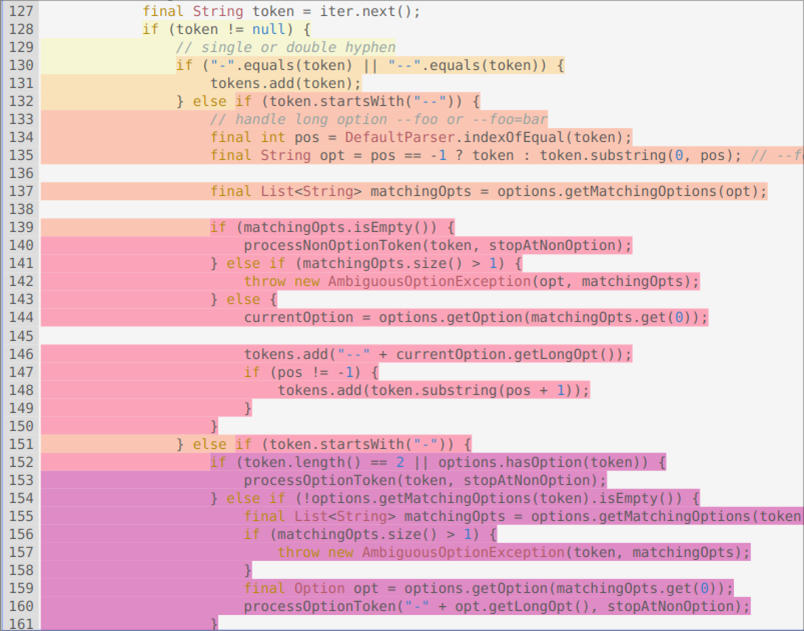

# Extending PMD

Use XPath to define a new rule for PMD to prevent complex code. The rule should detect the use of three or more nested `if` statements in Java programs so it can detect patterns like the following:

```Java
if (...) {
    ...
    if (...) {
        ...
        if (...) {
            ....
        }
    }

}
```
Notice that the nested `if`s may not be direct children of the outer `if`s. They may be written, for example, inside a `for` loop or any other statement.
Write below the XML definition of your rule.

You can find more information on extending PMD in the following link: https://pmd.github.io/latest/pmd_userdocs_extending_writing_rules_intro.html, as well as help for using `pmd-designer` [here](./designer-help.md).

Use your rule with different projects and describe you findings below. See the [instructions](../sujet.md) for suggestions on the projects to use.

## Answer

### XML Rule

This is the rule generated by pmd-design.
```xml
<rule name="NestedIfDepth3OrMore"
    language="java"
    message="There a nested IF of depth >= 3"
    class="net.sourceforge.pmd.lang.rule.xpath.XPathRule">
    <description>

    </description>
    <priority>3</priority>
    <properties>
        <property name="xpath">
        <value>
<![CDATA[
//IfStatement[count(.//IfStatement//IfStatement) >= 1]
]]>
        </value>
        </property>
    </properties>
</rule>
```


### Results

#### Example of match

Match of our rule on `commons-cli/src/main/java/org/apache/commons/cli/PosixParser.java`.



It can find deeply nested if. But it matches multiple time inside a match when there is a 3+ Nested If.   

#### Number of matches in the Different Codebase

```sh
cat outputs/commons-cli/java/NestedIf.out | wc -l
# => 25
cat outputs/commons-collections/java/NestedIf.out | wc -l
# => 38
cat outputs/commons-lang/java/NestedIf.out | wc -l
# => 134
cat outputs/commons-math/java/NestedIf.out | wc -l
# => 220
```

Since it match nested if inside other nested. We can have multiple match for a single 3+ nested if. Thus the number is not that accurate and does not match one time for a 3+ nested if.

#### Can be Improve

```java
// commons-math/commons-math-core/src/main/java/org/apache/commons/math4/core/jdkmath/AccurateMath.java:1442
public static double pow(final double x, final double y) {
    if (y == 0) {
        return 1.0;
    } else {
        if (yRawExp > 1085) {
            if ((yRawExp == 2047 && yRawMantissa != 0) ||
                (xRawExp == 2047 && xRawMantissa != 0)) {

                } else if (xRawExp == 1023 && xRawMantissa == 0) {
                    if (yRawExp == 2047) {
                        ...
                    } else {
                        ...
                    }
            } else {
                ...
            }
            ...
        }
        ...
    }
}
```

In this example thing could have been improve by using a Guard Clauses with the first if. 

```java
if (y == 0) {
        return 1.0;
} else {
    ...
}

// Into
if (y == 0) {
        return 1.0;
}
...
```

This would prevent high nested if. 


