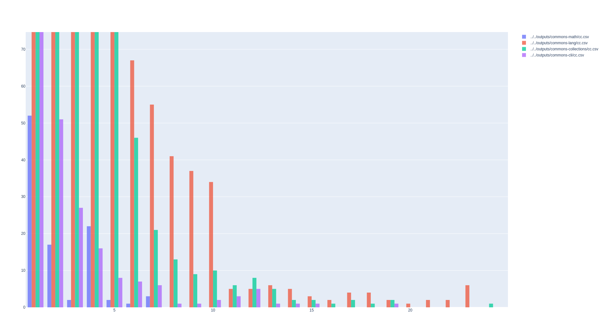
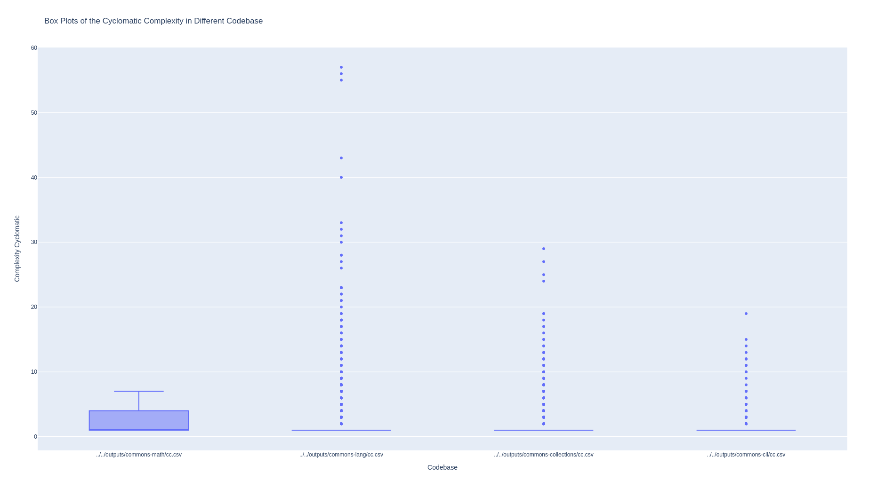

# Cyclomatic Complexity with JavaParser

With the help of JavaParser implement a program that computes the Cyclomatic Complexity (CC) of all methods in a given Java project. The program should take as input the path to the source code of the project. It should produce a report in the format of your choice (TXT, CSV, Markdown, HTML, etc.) containing a table showing for each method: the package and name of the declaring class, the name of the method, the types of the parameters and the value of CC.
Your application should also produce a histogram showing the distribution of CC values in the project. Compare the histogram of two or more projects.


Include in this repository the code of your application. Remove all unnecessary files like compiled binaries. Do include the reports and plots you obtained from different projects. See the [instructions](../sujet.md) for suggestions on the projects to use.

You may use [javaparser-starter](../code/javaparser-starter) as a starting point.

# Visualization  

# Info 

The printer generate a CSV file separated with `;`. The columns are `module/class info`, `method name/type`, `cc`. 

## Histogram visualization of CC for each code base
 

## Box plot visualization of CC for each code base
 

# Usage

```sh
cd code/Exercise5
# Compile
mvn package

# Run 
java -jar target/CyclomaticComplexityAnalysis-1.0-jar-with-dependencies.jar ../../projects_codebase/commons-cli/src > ../../outputs/commons-cli/cc.csv
java -jar target/CyclomaticComplexityAnalysis-1.0-jar-with-dependencies.jar ../../projects_codebase/commons-collections/src > ../../outputs/commons-collections/cc.csv
java -jar target/CyclomaticComplexityAnalysis-1.0-jar-with-dependencies.jar ../../projects_codebase/commons-lang/src > ../../outputs/commons-lang/cc.csv
java -jar target/CyclomaticComplexityAnalysis-1.0-jar-with-dependencies.jar ../../projects_codebase/commons-math/src > ../../outputs/commons-math/cc.csv

# Visualize with BoxPlot & Histogram
python script_graph/main.py ../../outputs/commons-math/cc.csv ../../outputs/commons-lang/cc.csv ../../outputs/commons-collections/cc.csv ../../outputs/commons-cli/cc.csv
```

