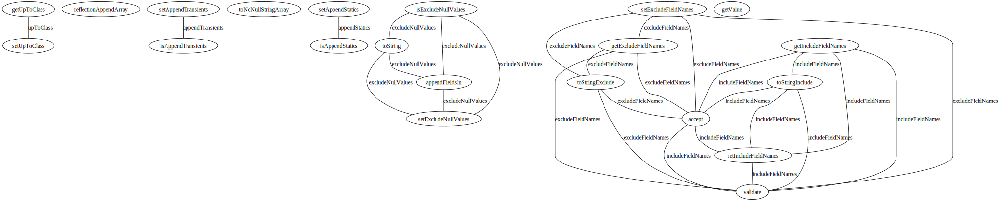
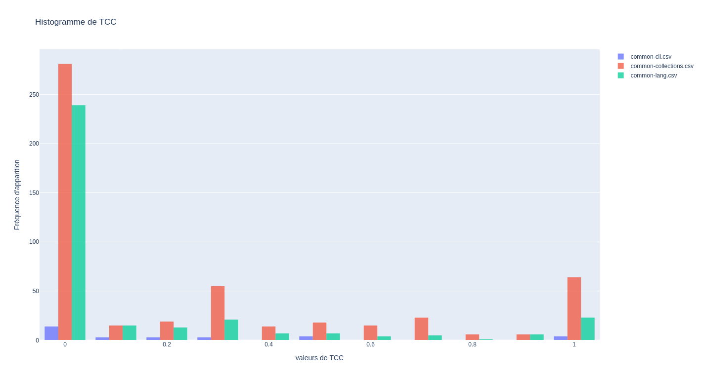
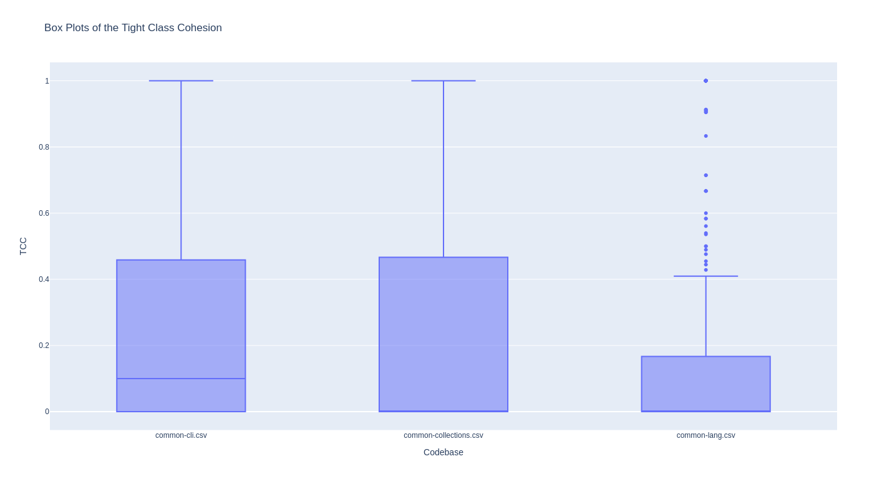

# Class cohesion with JavaParser

With the help of JavaParser implement a program that computes the Tight Class Cohesion (TCC) for each class in a given Java project. The program should take as input the path to the source code of the project. It should produce a report in the format of your choice (TXT, CSV, Markdown, HTML, etc.) containing a table showing for each class: the package, name and TCC value. 
Your application should also produce a histogram showing the distribution of CC values in the project. Compare the histogram of two or more projects.
Finally, your application should also produce the dependency graph of each class (cf. example [here](https://people.irisa.fr/Benoit.Combemale/pub/course/vv/vv-textbook-v0.1.pdf#cohesion-graph)). The graph should be written using the [GraphViz DOT format](https://www.graphviz.org/)

Ignore inherited members to compute TCC of a class.

Include in this repository the code of your application. Remove all unnecessary files like compiled binaries. Do include the reports and plots you obtained from different projects. See the [instructions](../sujet.md) for suggestions on the projects to use.

You may use [javaparser-starter](../code/javaparser-starter) as a starting point.

# Answers

To compile, run, and get an output in a csv file :

```sh
cd code/Exercise6/
mvn package
java -jar target/javaparser-starter-1.0-jar-with-dependencies.jar ../../projects_codebase/commons-lang/src/main > script_histo/common-lang.csv
java -jar target/javaparser-starter-1.0-jar-with-dependencies.jar ../../projects_codebase/commons-collections/src/main > script_histo/common-collections.csv
java -jar target/javaparser-starter-1.0-jar-with-dependencies.jar ../../projects_codebase/commons-cli/src/main > script_histo/common-cli.csv
java -jar target/javaparser-starter-1.0-jar-with-dependencies.jar ../../projects_codebase/commons-math/src/main > script_histo/common-math.csv
```

Running the project also create a folder [code/Exercise6/GraphViz](code/Exercise6/GraphViz).
For each class, a `.dot` file is created if the TCC and LCC are greater than zero, showing the graph dependency of the function.

To get a `svg` or `png` file from the `.dot` file, run the following commands :

```sh
cd cd code/Exercise6/GraphViz
dot -T<png|svg> <filename> > <output_file_name>
```

Here is with what we got with the `ReflectionToStringBuilder` class from the Apache project 
`commons-lang` :



To generate nice histogramms of TCC value, you can run the following command :

```sh
cd code/Exercise6/script_histo             # chage directory
python3 -m venv .venv                      # create a python virtual environment
source .venv/bin/activate                  # activate the environment
python3 -m pip install -r requirements.txt # install the dependencies
python3 main.py common-cli.csv common-collections.csv common-lang.csv common-math.csv
```

This last command should open your browser and show you the following boxplot and histogram :


